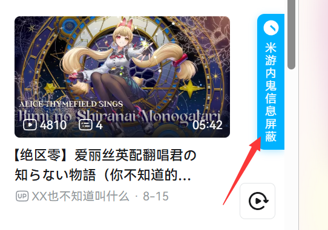

# Hoyo Leaks Block

**Language / 语言**：[中文](README.md) | English | [繁體中文](README_ZHT.md) | [日本語](README_JA.md)

## Introduction

This is a browser extension specifically designed for players of games under Hoyoverse, such as Genshin Impact, Honkai: Star Rail, Zenless Zone Zero, etc. It can automatically block content related to "leaks and negative campaigns" on major social platforms like Bilibili, YouTube, and Twitter (x.com).

> **Special Thanks**: This project is a refactored browser extension based on the original Tampermonkey script developed by @凡云 from Bilibili. Thanks to the original author for their open-source contribution! Original project: https://github.com/LCYBFF/genshinLeaksBlock

## Quick Start

- Chrome Browser: [Chrome Web Store](https://chromewebstore.google.com/detail/dpomdmennbkghcafeplkkhbejoneccal?utm_source=item-share-cb)
- Edge Browser: [Get Microsoft Edge Add-on](https://microsoftedge.microsoft.com/addons/detail/lkecpfnoeafijacmohjpffiekijjkmip)

## How to Use

1. After installing the extension, a blue floating button will appear on the right side of supported websites
   
2. Click the floating button or browser toolbar icon to access the settings page
   
3. Customize keywords, blacklists/whitelists, and areas in the settings page
   
4. Use "Sync Rules from Cloud" to get the latest blocking rules
   
5. You'll see the blocking effect on the page, mission accomplished!
   

## Configuration Guide

- **Blocking Keywords**: Add blocking keywords and click "Save Rules" to make them effective
- **Author Blacklist/Whitelist**: Add author blacklist/whitelist and click "Save Rules" to make them effective
- **Area Management**: Visually toggle, edit, and delete blocking areas for each platform. [Developer: Area Configuration Guide](docs/AREA_CONFIGURATION_GUIDE.md)
- **Configuration Import/Export**: Support JSON file import/export and remote updates
- **Remote Configuration**: Automatically retrieve the latest area configurations to keep blocking rules updated
- **Debug Mode**: Developers can enable debug logging in `core/common.js`

## Features

- 🛡️ **Multi-platform Support**: Bilibili, YouTube, Twitter (x.com)
- 🔍 **Smart Recognition**: Automatic identification of leak content by keywords and usernames
- ⚡ **Real-time Blocking**: Real-time monitoring and automatic blocking of page content
- 📝 **Custom Rules**: Support for custom keywords, blacklists, and whitelists
- 🎯 **Area Management**: Visual management of blocking areas with precise control
- 💾 **Configuration Management**: Support for import/export, remote updates, and cloud sync
- 🌐 **Remote Configuration**: Online retrieval of latest area configs and blocking rules
- 🎨 **Modern UI**: Clean and intuitive settings and popup interface
- 📊 **Statistics**: Count blocked content (daily/total)
- 🛠️ **Performance Optimization**: Debouncing/throttling with low resource usage
- 🔐 **Data Security**: Local storage, no user data upload
- 🌍 **Internationalization**: Multi-language interface (Simplified Chinese, Traditional Chinese, English, Japanese, etc.)
- 📋 **Debug Support**: Complete debug logging system

## Installation

### Install from Store

- Chrome Browser: [Chrome Web Store](https://chromewebstore.google.com/detail/dpomdmennbkghcafeplkkhbejoneccal?utm_source=item-share-cb)
- Edge Browser: [Get Microsoft Edge Add-on](https://microsoftedge.microsoft.com/addons/detail/lkecpfnoeafijacmohjpffiekijjkmip)

### Install from Source

1. Download or clone this project to your local machine
2. Open Chrome and visit `chrome://extensions/`
3. Enable "Developer mode"
4. Click "Load unpacked" (Edge) / "Load unpacked extension" (Chrome) and select the project folder

## Changelog

See [CHANGELOG.md](./CHANGELOG.md)

## Issues & Feedback

- Submit issues or suggestions at [GitHub Issues](https://github.com/kaedei/hoyo-leaks-block/issues)
- Please include detailed error information, reproduction steps, browser and OS versions

## License

[MIT License](./LICENSE)

Additional Terms: **Without explicit written permission from the copyright holder, this software may not be used for commercial purposes.**

## Acknowledgments

Thanks to the original Tampermonkey script author and all contributors!

---

**Note**: This extension is for personal learning and research only. Please comply with relevant platform terms.
