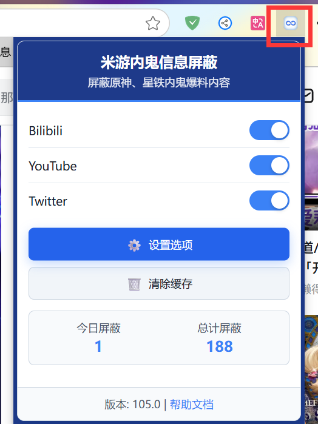
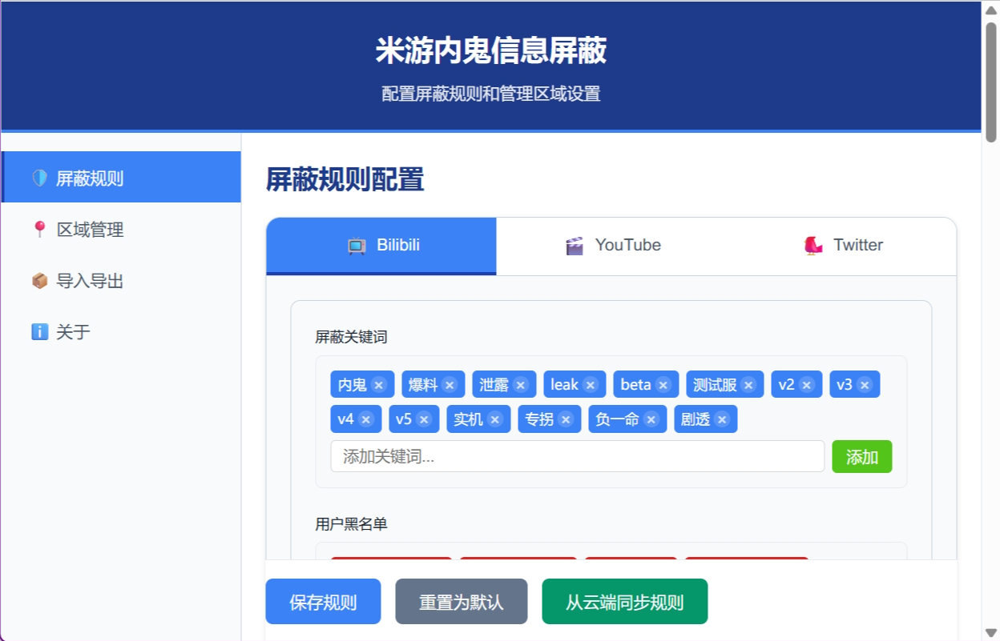

# Hoyo Leaks Block

**Language / 言語**：[中文](README.md) | [English](README_EN.md) | [繁體中文](README_ZHT.md) | 日本語

## 概要

これは、原神、崩壊：スターレイル、ゼンレスゾーンゼロなどの Hoyoverse 傘下のゲームプレイヤー向けに設計されたブラウザ拡張機能です。Bilibili、YouTube、Twitter（x.com）などの主要なソーシャルプラットフォームで「リーク情報やネガティブキャンペーン」に関連するコンテンツを自動的にブロックできます。

> **謝辞**: このプロジェクトは、Bilibili のユーザーである Phantom Cloud（@凡云）が開発したオリジナルの Tampermonkey スクリプトを基にリファクタリングされたブラウザ拡張機能です。オープンソースでの貢献に感謝いたします！元プロジェクト：https://github.com/LCYBFF/genshinLeaksBlock

## すぐに使用

- Chrome ブラウザ： [Chrome ウェブストア](https://chromewebstore.google.com/detail/dpomdmennbkghcafeplkkhbejoneccal?utm_source=item-share-cb)
- Edge ブラウザ： [Microsoft Edge アドオン](https://microsoftedge.microsoft.com/addons/detail/lkecpfnoeafijacmohjpffiekijjkmip)

## 使用方法

1. 拡張機能をインストール後、対応サイトを閲覧する際にページ右側に青いフローティングボタンが表示されます
   
2. フローティングボタンまたはブラウザツールバーアイコンをクリックして設定ページにアクセスできます
   
3. 設定ページでキーワード、ブラックリスト/ホワイトリスト、エリアなどをカスタマイズできます
   
4. 「クラウドからルールを同期」を使用して最新のブロックルールを取得できます
   
5. ページ内でブロック効果を確認できます。ミッション完了！
   

## 設定説明

- **ブロックキーワード**：ブロックキーワードを追加し、「ルールを保存」をクリックして有効にします
- **作者ブラックリスト/ホワイトリスト**：作者のブラックリスト/ホワイトリストを追加し、「ルールを保存」をクリックして有効にします
- **エリア管理**：各プラットフォームのブロックエリアを視覚的に切り替え、編集、削除できます。[開発者：エリア設定ガイド](docs/AREA_CONFIGURATION_GUIDE.md)
- **設定のインポート/エクスポート**：JSON ファイルのインポート/エクスポート、リモート更新に対応
- **リモート設定**：最新のエリア設定を自動取得し、ブロックルールを最新の状態に保ちます
- **デバッグモード**：開発者は `core/common.js` でデバッグログを有効にできます

## 機能特徴

- 🛡️ **複数のソーシャルプラットフォーム対応**：Bilibili、YouTube、Twitter（x.com）
- 🔍 **スマート認識**：キーワードとユーザー名によるリークコンテンツの自動識別
- ⚡ **リアルタイムブロック**：ページコンテンツのリアルタイム監視と自動ブロック
- 📝 **カスタムルール**：カスタムキーワード、ブラックリスト/ホワイトリストの対応
- 🎯 **エリア管理**：ブロックエリアの視覚的管理と精密制御
- 💾 **設定管理**：インポート/エクスポート、リモート更新、クラウド同期の対応
- 🌐 **リモート設定**：最新のエリア設定とブロックルールのオンライン取得
- 🎨 **モダン UI**：シンプルで直感的な設定とポップアップインターフェース
- 📊 **統計機能**：ブロックコンテンツ数の統計（日次/合計）
- 🛠️ **パフォーマンス最適化**：デバウンス/スロットリング、低リソース使用
- 🔐 **データセキュリティ**：ローカルストレージ、ユーザーデータのアップロードなし
- 🌍 **国際化対応**：多言語インターフェース（簡体字中国語、繁体字中国語、英語、日本語など）
- 📋 **デバッグサポート**：完全なデバッグログシステム

## インストール方法

### ストアからインストール

- Chrome ブラウザ： [Chrome ウェブストア](https://chromewebstore.google.com/detail/dpomdmennbkghcafeplkkhbejoneccal?utm_source=item-share-cb)
- Edge ブラウザ： [Microsoft Edge アドオン](https://microsoftedge.microsoft.com/addons/detail/lkecpfnoeafijacmohjpffiekijjkmip)

### ソースコードからインストール

1. このプロジェクトをローカルにダウンロードまたはクローンします
2. Chrome を開き、`chrome://extensions/` にアクセスします
3. 「デベロッパーモード」を有効にします
4. 「パッケージ化されていない拡張機能を読み込む」（Edge）/「パッケージ化されていない拡張機能を読み込む」（Chrome）をクリックし、プロジェクトフォルダを選択します

## 更新履歴

詳細は [CHANGELOG.md](./CHANGELOG.md) をご覧ください

## 問題報告

- [GitHub Issues](https://github.com/kaedei/hoyo-leaks-block/issues) で問題や提案を報告してください
- 詳細なエラー情報、再現手順、ブラウザとオペレーティングシステムのバージョンを添付してください

## ライセンス

[MIT License](./LICENSE)

追加条項：**著作権者の明示的な書面による許可なしに、本ソフトウェアを商用目的で使用することはできません。**

## 謝辞

オリジナルの Tampermonkey スクリプト作者とすべての貢献者に感謝いたします！

---

**注意**：この拡張機能は個人の学習と研究のみを目的としています。関連プラットフォームの利用規約を遵守してください。
