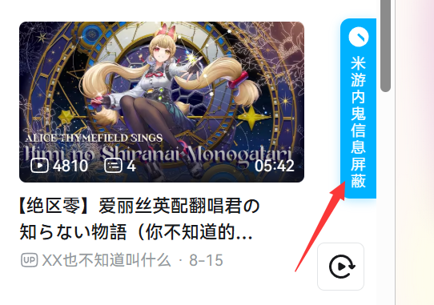
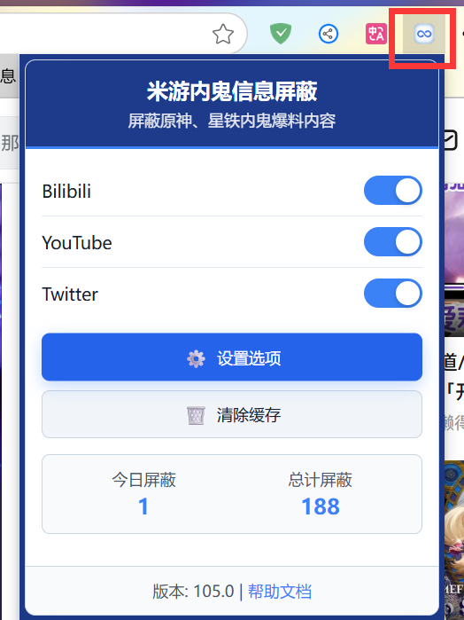

# 米游内鬼信息屏蔽 (Hoyo Leaks Block)

**Language / 語言**：[中文](README.md) | [English](README_EN.md) | 繁體中文 | [日本語](README_JA.md)

## 簡介

這是一個專為米哈遊旗下遊戲（如原神、星穹鐵道、絕區零等）玩家設計的瀏覽器擴展，能夠在 B 站、YouTube、Twitter（x.com）等主流社交平台上自動屏蔽與「内鬼爆料、黑流量」相關的內容。

> **致謝**: 本項目基於 B 站大佬 @凡雲 開發的原始 Tampermonkey 腳本重構而成，感謝原作者的開源貢獻！原項目地址：https://github.com/LCYBFF/genshinLeaksBlock

## 立刻使用

- Chrome 瀏覽器： [Chrome 應用商店](https://chromewebstore.google.com/detail/dpomdmennbkghcafeplkkhbejoneccal?utm_source=item-share-cb)
- Edge 瀏覽器： [取得 Microsoft Edge 擴充功能](https://microsoftedge.microsoft.com/addons/detail/lkecpfnoeafijacmohjpffiekijjkmip)

## 使用方法

1. 安裝擴展後，瀏覽受支援的網站時，頁面右側會出現藍色懸浮按鈕
   
2. 點擊懸浮按鈕或瀏覽器工具列圖標可進入設定頁面
   
3. 在設定頁面自定義關鍵詞、黑白名單、區域等
   
4. 使用「從雲端同步規則」取得最新的屏蔽規則
   
5. 在頁面中即可看到屏蔽效果，大功告成！
   

## 配置說明

- **屏蔽關鍵詞**：添加屏蔽關鍵詞，點擊「保存規則」使其生效
- **作者黑名單/白名單**：添加作者黑名單/白名單，點擊「保存規則」使其生效
- **區域管理**：可視化開關、編輯、刪除各平台屏蔽區域。[開發者：區域配置指南](docs/AREA_CONFIGURATION_GUIDE.md)
- **配置導入導出**：支援 JSON 檔案導入導出，遠程更新
- **遠程配置**：自動取得最新區域配置，保持屏蔽規則更新
- **除錯模式**：開發者可在 `core/common.js` 中啟用除錯日誌

## 功能特點

- 🛡️ **多個社交平台支援**：Bilibili、YouTube、Twitter（x.com）
- 🔍 **智能識別**：關鍵詞與用戶名自動識別爆料內容
- ⚡ **即時屏蔽**：頁面內容即時監控與自動屏蔽
- 📝 **自定義規則**：支援自定義關鍵詞、黑白名單
- 🎯 **區域管理**：可視化管理屏蔽區域，精準控制
- 💾 **配置管理**：支援導入導出、遠程更新與雲同步
- 🌐 **遠程配置**：線上取得最新區域配置和屏蔽規則
- 🎨 **現代 UI**：簡潔直觀的設定與彈窗介面
- 📊 **統計功能**：統計屏蔽內容數量（每日/總計）
- 🛠️ **效能優化**：防抖/節流，低資源佔用
- 🔐 **資料安全**：本機儲存，不上傳用戶資料
- 🌍 **國際化支援**：多語言介面（簡體中文、繁體中文、英語、日語等）
- 📋 **除錯支援**：完整的除錯日誌系統

## 安裝方法

### 從商店安裝

- Chrome 瀏覽器： [Chrome 應用商店](https://chromewebstore.google.com/detail/dpomdmennbkghcafeplkkhbejoneccal?utm_source=item-share-cb)
- Edge 瀏覽器： [取得 Microsoft Edge 擴充功能](https://microsoftedge.microsoft.com/addons/detail/lkecpfnoeafijacmohjpffiekijjkmip)

### 從源碼安裝

1. 下載或複製本項目到本機
2. 開啟 Chrome，訪問 `chrome://extensions/`
3. 開啟「開發者模式」
4. 點擊「載入未封裝的擴充功能」（Edge）/「載入未封裝的擴充功能」（Chrome），選擇項目資料夾

## 更新日誌

詳見 [CHANGELOG.md](./CHANGELOG.md)

## 問題回饋

- 在 [GitHub Issues](https://github.com/kaedei/hoyo-leaks-block/issues) 提交問題或建議
- 請附詳細錯誤資訊、重現步驟、瀏覽器與作業系統版本

## 授權條款

[MIT License](./LICENSE)

額外條款：**在未經版權持有者明確書面許可的情況下，本軟體不得用於商業目的。**

## 鳴謝

感謝原 Tampermonkey 腳本作者及所有貢獻者！

---

**注意**：本擴展僅供個人學習與研究，請遵守相關平台條款。
